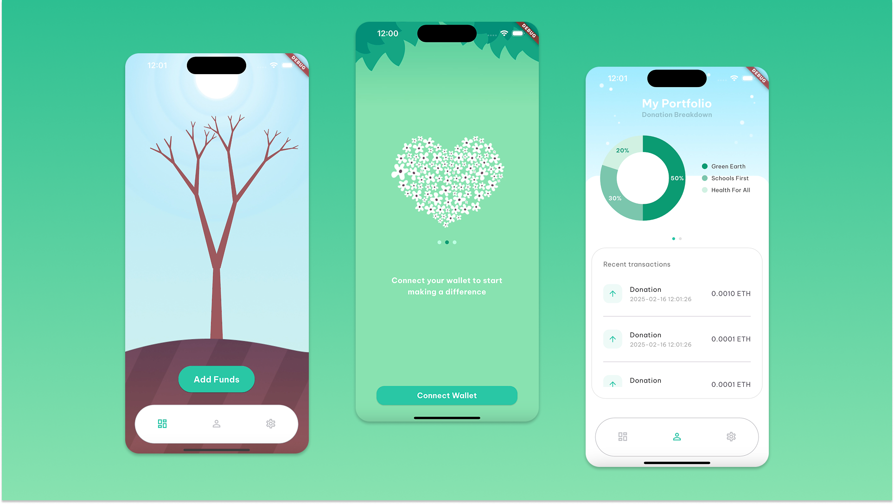

# The Giving Tree 

[](LICENSE.md) 


Intelligent, efficient, crypto donation platform powered by AI agents. **Taisu Venture Web3 For Social Good Award @ TreeHacks 2025**.



## Introduction

The Giving Tree is the most efficient and intelligent charitable donation portfolio manager. It takes the user’s mission statement (topics that they are passionate about) and creates their category portfolio. With live RSS feeds from news websites, our app tracks every article that it deems relevant to charity. It then sorts these articles into categories of impact. With these articles, we find charities that we could donate to and update our user’s charitable donation portfolio in real time to ensure that the user is making the most efficient and intelligent donations.

## Motivation

As natural disasters and social crises fill our news feeds today, the need for humanitarian aid is at an all time high. With charitable donations sometimes being the only thing many charities rely on to combat their respective issues, for causes such as natural disasters or international conflicts, timely donations make a real time impact. However, not all types of donations are helpful. Without knowing what a disaster-stricken community might need, donations of material goods can quickly cause problems, classified as the “Second Disaster”.

Our team discussed what allows rapid monetary transactions between a donor and a charity, through borders and roadblocks that material or cash donations could face, cryptocurrency. Cryptocurrency, once sent from one wallet to another is immediately a liquid asset one can use. Cryptocurrency is essential in areas where it is currently impossible to physically access banks and their services. With its speed, for charitable causes that require immediate reaction, crypto donations could contribute in helping hundreds to thousands and even millions of people. For example, just within seven days after the horrid Earthquakes in Turkey and Syria, AHBAP, a local non-profit, managed to raise 4.9 million dollars through crypto donations. It is also reported that around 20% of non-state aid to Ukraine was done in crypto currency.

But nobody has time to constantly check the news, find a charity related to a topic, and donate. We wanted to come up with the most efficient way to assist users with crypto charity donations while being responsive to urgent news that relates to causes that they wish to donate to.

## Technologies

The Giving Tree is built with a Flutter front end, Python FastAPI backend scripts, a database layer including both Postgres and ChromaDB cloud databases, as well as a series of AI agents to help us cater a collection of charities to most effectively handle user’s crypto. Our chroma databases use similarity search with the embeddings to provide the framework in sorting and filtering out news articles and charities.

We scraped charity data from a series of websites, gathering wallet addresses, names, and descriptions to help determine donation portfolios. Additionally, we are constantly scraping RSS feeds for new articles, which are filtered by relevance and further processed through a similarity search to find the most relevant charities. This information, along with user data, is passed to smart contract functions to execute and record transactions on the block chain.

## Installation & Setup
### Running the Flutter App
Clone the repository

```
git clone git@github.com:emilyjsun/GivingTree.git
```

Install [Flutter](https://docs.flutter.dev/) for your development platform and navigate to the `/app` folder
```
cd GivingTree/app 
```

Install project dependencies
```
flutter pub get
```

Run the app
```
flutter run
```

## Our Team
* Andy Ko (andy.ko@duke.edu)
* Arvindh Manian (arvindh.manian@duke.edu)
* Rally Lin (rally.lin@duke.edu)
* Emily Sun (emily.j.sun@duke.edu)
